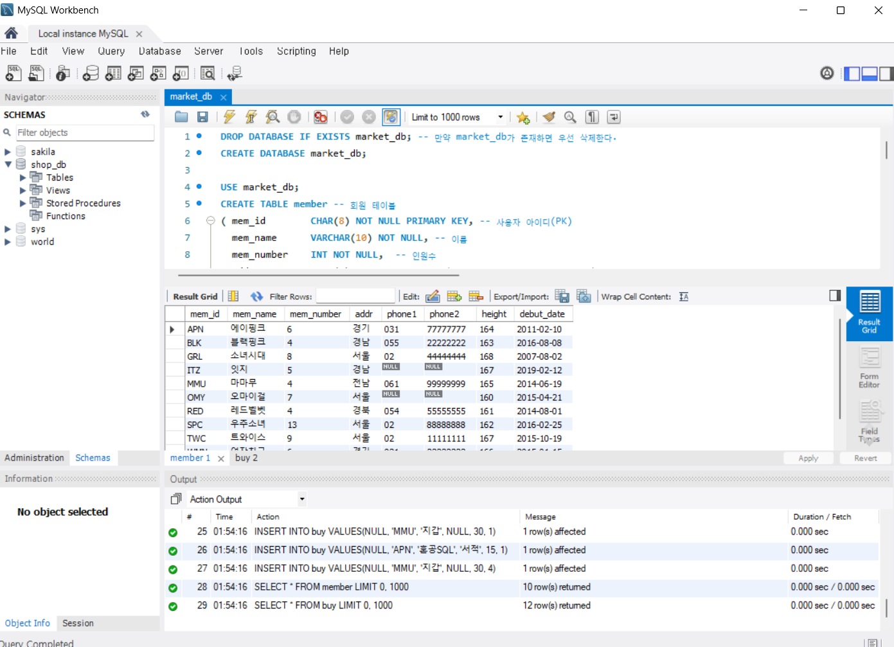
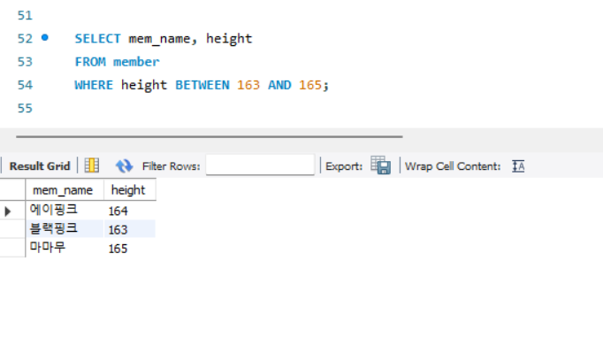
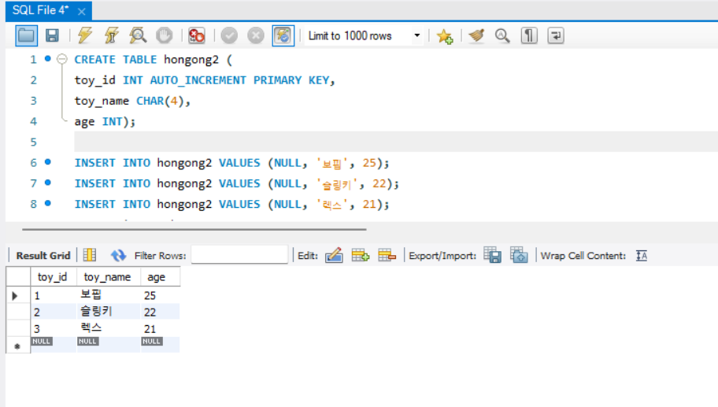
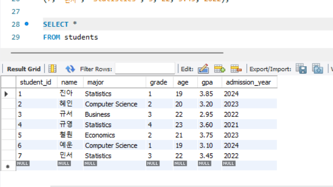
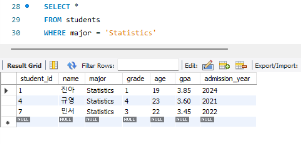
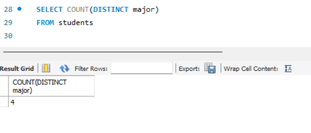
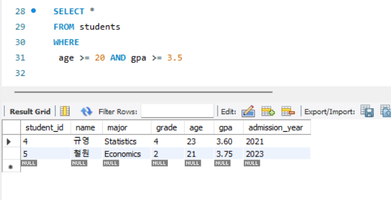
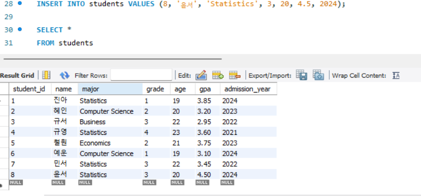

# SQL_ADVANCED 2주차 정규 과제 

📌SQL_ADVANCED 정규과제는 매주 정해진 분량의 『*혼자 공부하는 SQL*』 을 읽고 학습하는 것입니다. 이번주는 아래의 **SQL_ADVANCED_2nd_TIL**에 나열된 분량을 읽고 공부하시면 됩니다.

아래의 문제를 풀어보며 학습 내용을 점검하세요. 문제를 해결하는 과정에서 개념을 스스로 정리하고, 필요한 경우 제시된 강의를 참고하여 보완하는 것이 좋습니다.

<!-- 강의 링크는 아래와 같습니다.
https://www.youtube.com/watch?v=_JURyg_KzHE&list=PLVsNizTWUw7GCfy5RH27cQL5MeKYnl8Pm&index=7
https://www.youtube.com/watch?v=6qkPy7RfLqQ&list=PLVsNizTWUw7GCfy5RH27cQL5MeKYnl8Pm&index=8
https://www.youtube.com/watch?v=WWAFAm9op2U&list=PLVsNizTWUw7GCfy5RH27cQL5MeKYnl8Pm&index=9
-->

**교재 실습 예제 파일은 07_SQL_ADVANCED_Template 레포지토리의 src 폴더에 업로드되어 있습니다. market_db 파일도 해당 폴더에 함께 포함되어 있으니 참고하시기 바랍니다.**

**👀(수행 인증샷은 필수입니다.)** 

## SQL_ADVANCED_2nd_TIL

### 3장 SQL 기본 문법
#### 01. 기본 중에 기본 SELECT ~ FROM ~ WHERE
#### 02. 좀 더 깊게 알아보는 SELECT문
#### 03. 데이터 변경을 위한 SQL문


## Study Schedule

| 주차  | 공부 범위     | 완료 여부 |
| ----- | ------------- | --------- |
| 1주차 | p.24~99    | ✅         |
| 2주차 | p.102~155   | ✅         |
| 3주차 | p.158~213  | 🍽️         |
| 4주차 | p.216~271 | 🍽️         |
| 5주차 | p.274~327 | 🍽️         |
| 6주차 | p.330~369 | 🍽️         |
| 7주차 | p.372~407 | 🍽️         |


<br>

<!-- 여기까진 그대로 둬 주세요-->

---

# 1️⃣ 학습 내용 정리

## 1. 기본 중에 기본 SELECT ~ FROM ~ WHERE

### 기본 조회하기: SELECT ~ FROM
#### USE문
- 현재 사용하는 데이터베이스 지정하기
- '지금부터 이 DB를 사
용하겠으니 모든 쿼리는 이 DB에
서 실행하라'라는 의미
~~~sql
USE 데이터베이스 이름;
~~~

#### SELECT 문의 기본 형식
~~~sql
SELECT select_expr
[FROM table_references]
[WHERE where_condition]
[GROUP BY {col_name | expr | position}]
[HAVING where_condition]
[ORDER BY {col_name expr position}]
[LIMIT {[offset,] row_count row_count OFFSET offset}]
~~~

##### select_expr
- SELECT * FROM market_db.member;
  - 데이터베이스 이름을 생략하면 USE 문으로 지정해 놓은 데이터베이스가 자동으로 선택됨.
- SELECT mem_name FROM member;
  - 여러 개의 열을 가져오고 싶으면 콤마(,)로 구분하면 됨.

### 특정한 조건만 조회하기: SELECT ~ FROM ~ WHERE
#### WHERE 없이 조회하기
- WHERE가 없이 SELECT ~ FROM만으로 테이블을 조회하면 테이블의 모든 행이 출력됨

#### 기본적인 WHERE 절
~~~sql
SELECT 열_이름
FROM 테이블 이름
WHERE 조건식
~~~

#### 관계 연산자, 논리 연산자의 사용
- 숫자로 표현된 데이터는 관계 연산자를 사용하요 표현할 수 있음
-  조건이 모두 만족해야 하는 것이라면 AND, 두 조건 중 하나만 만족해도 되면 OR을 사용할 수 있음

#### BETWEEN~ AND
-  범위에 있는 값을 구하는 경우

#### IN()
- 조건식에서 여러 문자 중 하나에 포함되는지 비교할 때
- OR 여러개 쓰는것보다 훨씬 간결

#### LIKE
- 문자열의 일부 글자를 검색
- %: 무엇이든 허용
- 한 글자와 매치하기 위해서는 언더바()를 사용




> **확인문제: 다음 SQL문의 빈칸에 들어갈 WHERE절의 문법으로 틀린 것을 고르세요.**

```sql
SELECT *
FROM table_name
WHERE ________;
```

보기는 아래와 같습니다.
```
1. mem_number == 4
2. mem_number >= 4
3. mem_number <= 4
4. mem_number = 4
```

```
1번, ==은 SQL에서 쓰이는 연산자가 아니다. 
```


## 2. 좀 더 깊게 알아보는 SELECT문
### ORDER BY 절
- ORDER BY col_name ASC(기본값): 오름차순
- ORDER BY col_name DESC(기본값): 내림차순
- ORDER BY 절은 WHERE 절 다음에 나와야함
- 정렬 기준은 1개 열이 아니라 여러 개 열로 지정할 수 있음
  ~~~sql
  ORDER BY height DESC, debut_date ASC;
  ~~~

### 출력의 개수를 제한: LIMIT
- `LIMIT 시작, 개수`
- '시작'번째부터 '개수'건만 조회

### 중복된 결과를 제거: DISTINCT
- 열 이름 앞에 붙이면, 조회된 결과에서 중복된 데이터를 1개만 남김

### GROUP BY 절
- 말그대로 데이터를 그룹화해줌. 주로 집계함수와 같이 사용됨.

#### 집계함수
- SUM(): 합계
- AVG(): 평균
- MIN(): 최소값
- MAX(): 최대값
- COUNT(): 행의 개수
- COUNT(DISTINCT): 행의 개수(중복은 1개만 인정)

### Having 절
- WHERE와 비슷한 개념으로 조건을 제한하는 것이지만, 집계 함수에 대해서 조건을 제한하는 것 -> 꼭 GROUP BY 절 다음에 나와야 함!!


> **확인문제: 다음 표는 주요 집계함수를 정리한 것입니다. 각 설명에 해당하는 올바른 함수명을 기호에 맞게 작성하세요.**

| 함수명 | 설명 |
|--------|------|
| SUM() | 합계를 구합니다. |
| (ㄱ) | 평균을 구합니다. |
| (ㄴ) | 최소값을 구합니다. |
| MAX() | 최대값을 구합니다. |
| (ㄷ) | 행의 개수를 셉니다. |
| (ㄹ) | 행의 개수를 셉니다 (중복은 1개만 인정). |

```
여기에 답을 적어주세요!
(ㄱ) AVG()
(ㄴ) MIN()
(ㄷ) COUNT()
(ㄹ) COUNT DISTINCT
```


## 3. 데이터 변경을 위한 SQL문

### 데이터 입력: INSERT
#### INSERT 문의 기본 문법
~~~sql
INSERT INTO 테이블 [(열1, 열2, ...)] VALUES (값1, 값2, ...)
~~~
- 테이블 이름 다음에 나오는 열은 생략이 가능 -> 이 경우엔 VALUES 다음에 나오는 값들의 순서 및 개수는 테이블을 정의할 때의 열 순서 및 개수와 동일
- 특정 열에 입력하고 싶지 않다면 열 자리에 NULL이 들어가야함
- 열의 순서를 바꿔서 입력하고 싶을 때는 열 이름과 값을 원하는 순서에 맞춰 써줌

#### 자동으로 증가하는 AUTO_INCREMENT
- 열을 정의할 때 1부터 증가하는 값을 입력해줌



#### 다른 테이블의 데이터를 한 번에 입력하는 INSERT INTO ~ SELECT
- 다른 테이블에 이미 데이터가 입력되어 있다면 INSERT INTO ~ SELECT 구문을 사용해 해당 테이블의 데이터를 가져와서 한 번에 입력 가능
~~~sql
INSERT INTO 테이블_이름(열_이름1, 열_이름2, ...)
SELECT 문
~~~

### 데이터 수정: UPDATE
- 기존에 입력되어 있는 값을 수정하는 명령
~~~sql
UPDATE 테이블 이름
SET 열1=값1, 열2=값2, ...
WHERE 조건
~~~

#### WHERE가 없는 UPDATE 문
- UPDATE 문에서 WHERE 절은 문법상 생략이 가능하지만, WHERE 절을 생략하면 테이블의 모든 행의 값이 변경됨. 일반적으로 전체 행의 값을 변경하는 경우는 별로 없으므로 주의!!!

### 데이터 삭제: DELETE
- 행 단위로 삭제
~~~sql
DELETE FROM 테이블이름 WHERE 조건
~~~
> **확인문제: 다음이 설명하는 SQL이 무엇인지 쓰세요.**

```
* 데이터를 삭제합니다.
* DELETE와 동일한 효과를 내지만 속도가 무척 빠릅니다.
* 삭제 후에 빈 테이블이 남아 있습니다.
```

```
TRUNCATE
```


---

# 2️⃣ 실습과제

## 1. 데이터베이스 구축

아래 코드를 MySQL Workbench에 붙여넣은 후,  
**전체 드래그 → 실행 (Ctrl + shift + Enter)** 하여 데이터베이스를 구축하세요.

```sql
-- 1. 데이터베이스 생성
CREATE DATABASE IF NOT EXISTS week2_db;

-- 2. 사용할 데이터베이스 선택
USE week2_db;

-- 4. 테이블 생성
CREATE TABLE students (
    student_id INT PRIMARY KEY,
    name VARCHAR(20),
    major VARCHAR(30),
    grade INT,
    age INT,
    gpa DECIMAL(3,2),
    admission_year INT
);

-- 5. 데이터 삽입
INSERT INTO students VALUES
(1, '진아', 'Statistics', 1, 19, 3.85, 2024),
(2, '혜인', 'Computer Science', 2, 20, 3.20, 2023),
(3, '규서', 'Business', 3, 22, 2.95, 2022),
(4, '규영', 'Statistics', 4, 23, 3.60, 2021),
(5, '철원', 'Economics', 2, 21, 3.75, 2023),
(6, '예운', 'Computer Science', 1, 19, 3.10, 2024),
(7, '민서', 'Statistics', 3, 22, 3.45, 2022);
```
## 2. 실습 문제

다음 SQL 문을 작성하고 실행 결과를 확인 후 인증 사진을 아래에 업로드하세요.

1. 모든 학생의 정보를 조회하시오.
2. 전공이 'Statistics'인 학생을 조회하시오.
3. 현재 students 테이블에 존재하는 서로 다른 전공의 개수를 구하시오.
4. 나이가 20 이상이고 GPA가 3.5 이상인 학생을 조회하시오.
5. students 테이블에 본인의 정보를 직접 INSERT 하시오. (INSERT 실행 후, 데이터가 정상적으로 추가되었는지 확인할 수 있도록 조회 결과까지 포함하여 캡처하시오.)








### 🎉 수고하셨습니다.


