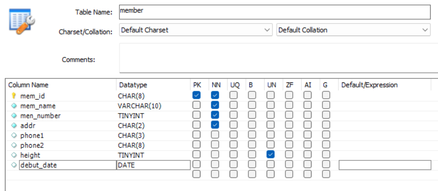
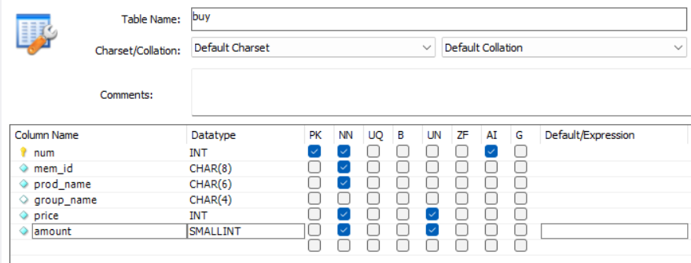
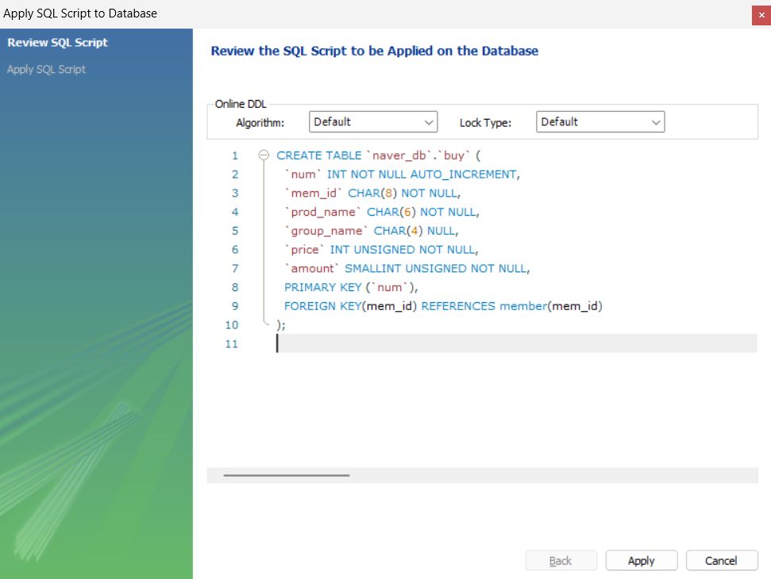
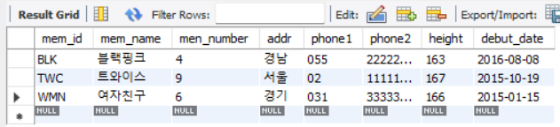
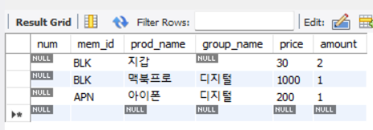
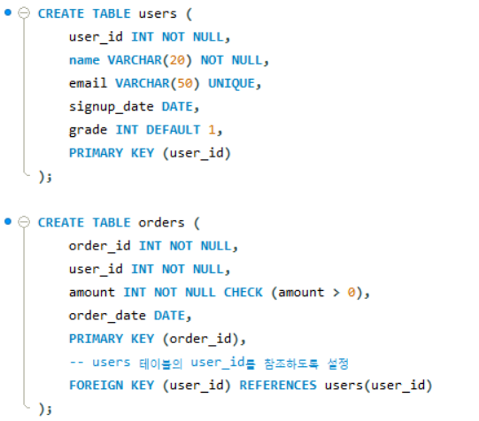
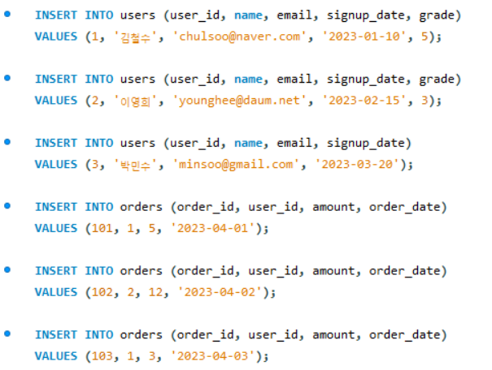
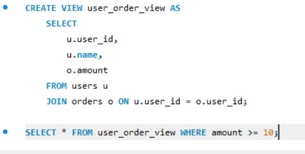

# SQL_ADVANCED 4주차 정규 과제 

📌SQL_ADVANCED 정규과제는 매주 정해진 분량의 『*혼자 공부하는 SQL*』 을 읽고 학습하는 것입니다. 이번주는 아래의 **SQL_ADVANCED_4th_TIL**에 나열된 분량을 읽고 공부하시면 됩니다.

아래의 문제를 풀어보며 학습 내용을 점검하세요. 문제를 해결하는 과정에서 개념을 스스로 정리하고, 필요한 경우 제시된 강의를 참고하여 보완하는 것이 좋습니다.

<!-- 강의 링크는 아래와 같습니다.
https://www.youtube.com/watch?v=DMNpkj_bZIs&list=PLVsNizTWUw7GCfy5RH27cQL5MeKYnl8Pm&index=13
https://www.youtube.com/watch?v=BUHj-behLyc&list=PLVsNizTWUw7GCfy5RH27cQL5MeKYnl8Pm&index=14
https://www.youtube.com/watch?v=JrXWxku7ZIM&list=PLVsNizTWUw7GCfy5RH27cQL5MeKYnl8Pm&index=15
-->

**교재 실습 예제 파일은 07_SQL_ADVANCED_Template 레포지토리의 src 폴더에 업로드되어 있습니다. market_db 파일도 해당 폴더에 함께 포함되어 있으니 참고하시기 바랍니다.**

**👀(수행 인증샷은 필수입니다.)** 

## SQL_ADVANCED_4th_TIL

### 5장 테이블과 뷰
#### 01. 테이블 만들기
#### 02. 제약조건으로 테이블을 견고하게
#### 03. SQL 가상의 테이블: 뷰 


## Study Schedule

| 주차  | 공부 범위     | 완료 여부 |
| ----- | ------------- | --------- |
| 1주차 | p.24~99    | ✅         |
| 2주차 | p.102~155   | ✅         |
| 3주차 | p.158~213  | ✅         |
| 4주차 | p.216~271 | ✅         |
| 5주차 | p.274~327 | 🍽️         |
| 6주차 | p.330~369 | 🍽️         |
| 7주차 | p.372~407 | 🍽️         |


<br>

<!-- 여기까진 그대로 둬 주세요-->

---

# 1️⃣ 학습 내용 정리

## 1. 테이블 만들기 
### GUI 환경에서 테이블 만들기
#### 데이터베이스 생성하기
1. SQL 쿼리로 데이터베이스 생성
```sql
CREATE DATABASE naver_db;
```
2. [SCHEMAS] 패널의 빈 곳에서 마우스 오른쪽 버튼을 클릭하고 [Refresh All]을
선택하면 확인 가능
- (데이터베이스 삭제하고 싶으면 `DROP DATABASE naver_db`)
#### 테이블 생성하기
1.  [SCHEMAS] 패널 - [naver_db] 데이터베이스 - [Tables] 선택 - 마우스 오른쪽 버튼을 클릭해 [Create Table] 선택
2. 테이블 구성하기

  - PK: PRIMARY KEY
  - NN: NOT NULL
  - UN: UNSIGNED

  - AI: AUTO INCREMENT
3. 코드 확인 후 [Apply], [Finish] 버튼을 차례로 클릭해서 내용 적용

  - GUI에서는 PK-FK 관계 설정 못하여 코드 따로 수정 필요 -> 일대다 관계 형성!
    ```sql
    PRIMARY KEY (`num`),
    FOREIGN KEY(mem_id) REFERENCES member(mem_id)
    ```
#### 데이터 입력하기
1. [SCHEMAS] 패널 - [naver_db] 데이터베이스 - [Tables] - [member]/[buy] 선택 - 마우스 오른쪽 버튼 클릭해 [Select Rows - Limit 1000] 선택
2. 데이터 값 입력하기


  - 위 사진은 오류 ->  `members` 테이블과 `buy` 테이블은 PK-FK 관계임. 현재 `members` 테이블에 APN이라는 회원이 존재하지 않기에 APN은 FK에 쓰일 수가 없음. 
  - 행 삭제: 삭제하려는 행 오른쪽 클릭 -  [Delete Rows(s)] 선택
  - Auto Increment인 행(`num`)은 값 입력안하고 비워두기!
3. 코드 확인 후 [Apply], [Finish] 버튼을 차례로 클릭해서 내용 적용
### SQL로 테이블 만들기
#### 데이터베이스 생성하기 & 테이블 만들기
member 테이블 만들기
```sql
DROP TABLE IF EXISTS member; -- 기존에 있으면 삭제
CREATE TABLE member
( mem_id CHAR(8) NOT NULL PRIMARY KEY, -- 기본 키 설정(기본키는 자동으로 NOT NULL)
  mem_name VARCHAR(10) NOT NULL,
  mem_number TINYINT NOT NULL,
  addr CHAR(2) NOT NULL,
  phone1 CHAR(3) NULL,
  phone2 CHAR(8) NULL,
  height TINYINT UNSIGNED NULL,
  debut_date DATE NULL
);
```
buy 테이블 만들기
```sql
DROP TABLE IF EXISTS buy; -- 기존에 있으면 삭제
CREATE TABLE buy 
( num INT AUTO_INCREMENT NOT NULL PRIMARY KEY, 
  mem id CHAR(8) NOT NULL, 
  prod_name CHAR (6) NOT NULL, 
  group_name CHAR(4) NULL, 
  price INT UNSIGNED NOT NULL, 
  amount SMALLINT UNSIGNED NOT NULL,
  FOREIGN KEY(mem_id) REFERENCES member(mem_id) -- 외래 키 설정
);
```
#### 데이터 입력하기
member 데이터 입력하기
```sql
INSERT INTO member VALUES('TWC', '트와이스', 9, '서울', '02',
'11111111', 167, '2015-10-19');
INSERT INTO member VALUES('BLK', '블랙핑크', 4, '경남', '055',
'22222222', 163, '2016-8-8');
INSERT INTO member VALUES('WMN', '여자친구', 6, '경기', '031',
'33333333', 166, '2015-1-15');
```
  - DATE로 지정된 열에는 연.월.일 또는 연-월-일 형식으로 값을 입력
buy 데이터 입력하기
```sql
INSERT INTO buy VALUES(NULL, 'BLK', '지갑', NULL, 30, 2);
INSERT INTO buy VALUES(NULL, 'BLK', '맥북프로', '디지털', 1000, 1);
INSERT INTO buy VALUES( NULL, 'APN', '아이폰', '디지털', 200, 1); -- 오류!: buy 테이블의 mem_id는 꼭 member 테이블의 mem_id에도 값이 있어야함  
```
## 2. 제약조건으로 테이블을 견고하게 
### 제약조건의 기본 개념과 종류
**제약조건**: 데이터의 무결성을 지키기 위해 제한하는 조건
### 기본 키 제약조건
**기본 키**: 데이터를 구분할 수 있는 식별자
- 기본 키에 입력되는 값은 중복될 수 없고, NULL 값이 입력될 수 없음
- 한 테이블 당 1개의 열에 기본키 지정 가능
- 기본 키로 생성한 것은 자동으로 클러스터형 인덱스 생성
#### CREATE TABLE에서 설정하는 기본 키 제약조건
-  열 이름 뒤에 PRIMARY KEY 붙이기
    ```sql
    USE naver_db;
    DROP TABLE IF EXISTS buy, member;
    CREATE TABLE member
    ( mem_id CHAR(8) NOT NULL PRIMARY KEY, 
      mem_name VARCHAR(10) NOT NULL,
      height TINYINT UNSIGNED NULL
    );
    ```
- 제일 마지막 행에 `PRIMARY KEY (mem_id)` 추가
    ```sql
    DROP TABLE IF EXISTS member;
    CREATE TABLE member
    ( mem_id CHAR(8) NOT NULL,
      mem_name VARCHAR(10) NOT NULL,
      height TINYINT UNSIGNED NULL,
    PRIMARY KEY (mem_id)
    );
    ```
#### ALTER TABLE에서 설정하는 기본 키 제약조건
- 이미 만들어진 테이블을 수정하는 `ALTER TABLE` 구문 사용
    ```sql
    DROP TABLE IF EXISTS member;
    CREATE TABLE member
    ( mem_id CHAR(8) NOT NULL,
      mem_name VARCHAR(10) NOT NULL,
      height TINYINT UNSIGNED NULL
    );
    ALTER TABLE member
        ADD CONSTRAINT
        PRIMARY KEY (mem_id);
    ```
### 외래 키 제약조건
- 기준 테이블: 참조하는 키가 포함된 테이블
  - 이때 참조하는 키는 기본 키나 고유 키로 설정돼야함
- 참조 테이블: 외래 키가 포함된 테이블
- 외래 키 제약조건: 기준 테이블과 참조 테이블의 관계를 연결해 데이터의 무결성 보장 -> 외래 키는 반드시 참조하는 기준 테이블의 열에도 존재
#### CREATE TABLE에서 설정하는 외래 키 제약조건
```sql
DROP TABLE IF EXISTS buy, member;
CREATE TABLE member
( mem_id CHAR(8) NOT NULL PRIMARY KEY,
  mem_name VARCHAR(10) NOT NULL,
  height TINYINT UNSIGNED NULL
);
CREATE TABLE buy
( num INT AUTO_INCREMENT NOT NULL PRIMARY KEY,
  mem_id CHAR(8) NOT NULL,
  prod_name CHAR(6) NOT NULL,
  FOREIGN KEY(mem_id) REFERENCES member(mem_id)
);
```
-> 이때 기준 테이블에서 참조하는 열의 이름과 외래 키로 설정하려는 열의 이름은 꼭 안같아도 됨. 그러나 두 열은 같은것을 의미하니, 가급적 같은 이름 사용 권장. 
#### ALTER TABLE에서 설정하는 외래 키 제약조건
```sql
DROP TABLE IF EXISTS buy;
CREATE TABLE buy
( num INT AUTO_INCREMENT NOT NULL PRIMARY KEY,
  mem_id CHAR(8) NOT NULL,
  prod_name CHAR(6) NOT NULL
);
ALTER TABLE buy
    ADD CONSTRAINT
    FOREIGN KEY(mem_id) 
    REFERENCES member(mem_id);
```
#### 기준 테이블의 열이 변경될 경우

> **확인문제: 다음 보기 중에서 각 문항이 설명하는 것을 고르세요.**

보기는 아래와 같습니다.
```
CHECK / DEFAULT / PRIMAY KEY / UNIQUE / NOT NULL / FOREIGN KEY
```

```
여기에 답과 그 이유를 적어주세요!
1. 입력되는 데이터가 조건에 맞는지 검사하는 기능: CHECK
2. 값을 입력하지 않으면 자동으로 들어갈 값: DEFAULT
3. 빈 값을 입력하는 것을 허용하지 않음: NOT NULL
```


## 3. 가상의 테이블: 뷰 

<!-- 뷰에 관해 배우게 된 점을 적어주세요. -->

> **확인문제: 다음은 뷰의 특징입니다. 거리가 먼 것을 하나 고르세요.**

보기는 아래와 같습니다.
```
1️⃣ 뷰에는 테이블의 모든 열을 포함시켜야 합니다.
2️⃣ 뷰는 복잡한 SQL을 단순하게 만드는 효과가 있습니다.
3️⃣ 뷰는 보안에 도움이 됩니다.
4️⃣ 일부 사용자가 테이블에는 접근하지 못하게 하고, 뷰에만 접근하도록 설정할 수 있습니다.
```

```
1. 굳이 모든 열을 포함시킬 필요 없음
```


---

# 2️⃣ 실습과제

## 1. 데이터베이스 구축

아래 코드를 MySQL Workbench에 붙여넣은 후,  
**전체 드래그 → 실행 (Ctrl + Shift + Enter)** 하여 데이터베이스를 생성하세요.

```sql
CREATE DATABASE IF NOT EXISTS week4_db;
USE week4_db;
```

## 2. 실습문제

1. 다음 조건을 만족하는 `users` 테이블을 생성하시오.
```
- user_id는 INT이며 **기본키(Primary Key)**로 설정합니다.
- name은 VARCHAR(20)이며 NULL을 허용하지 않습니다.
- email은 VARCHAR(50)이며 중복을 허용하지 않습니다.
- signup_date는 DATE 타입으로 설정합니다.
- grade는 INT이며 기본값(Default)을 1로 설정합니다.
```

2. 다음 조건을 만족하는 orders 테이블을 생성하시오.
```
- order_id는 INT이며 기본키(Primary Key)로 설정합니다.
- user_id는 INT이며 NULL을 허용하지 않습니다.
- amount는 INT이며 0보다 커야 합니다.
- order_date는 DATE 타입으로 설정합니다.
```


3. 다음 조건을 만족하여 데이터를 삽입하시오.
```
- users 테이블에 3명 이상의 데이터를 직접 INSERT 하시오.
- orders 테이블에 3건 이상의 데이터를 직접 INSERT 하시오.
```

4. users와 orders 테이블을 활용하여 다음 컬럼을 보여주는 뷰 user_order_view를 생성하시오.
```
- user_id
- name
- amount
```

5. 생성한 user_order_view를 조회하시오.

## 3. 제출 방법

1. 각 문제의 실행 결과가 보이도록 화면을 캡처합니다.
2. 테이블 생성 결과, 데이터 삽입 결과, 뷰 생성 및 조회 결과가 모두 보이도록 제출합니다.

<!-- 이 부분을 지우고 인증사진을 제출해주세요.-->

### 🎉 수고하셨습니다.


